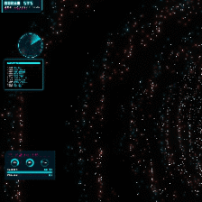

# 🎵 Cyber Visualizer & Gesture Control
# 赛博朋克手势交互音乐可视化

  

A high-performance audio visualizer for **Wallpaper Engine**, featuring particle physics, cyberpunk HUD elements, and AI-powered hand gesture control.

这是一个用于 **Wallpaper Engine** 的高性能音频可视化壁纸，具有粒子物理效果、赛博朋克风格的 HUD 界面以及基于 AI 的手势控制功能。


*(如果你有预览图，请确保文件名是 preview.gif 并放在根目录，或者删除这行)*

## ✨ Features / 功能亮点

- **🧬 Advanced Particle System**: 45,000+ interactive particles with bloom effects.
  - **高级粒子系统**：45,000+ 个带有泛光效果的交互式粒子。
- **👋 AI Gesture Control**: Control the visualizer using your webcam (powered by MediaPipe).
  - **AI 手势控制**：通过摄像头控制视觉效果（基于 MediaPipe）。
- **🎧 Audio Reactive**: Particles dance to the bass, mid, and high frequencies of your music.
  - **音频响应**：粒子会随着音乐的低音、中音和高音跳动。
- **🎨 Customization**:
  - **9 Geometry Modes**: Wormhole, Supernova, Cyber Grid, etc.
  - **4 Color Modes**: Cyberpunk, Rainbow, Dual Gradient, Monochrome.
  - **HUD Elements**: Radar, Energy Bar, CPU/RAM gauges (simulated), Terminal logs.
  - **自定义**：9种几何模式、4种色彩模式以及丰富的 HUD 界面元素。

## 🎮 Controls / 操作说明

### Webcam Gestures (需在设置中开启摄像头)
Ensure you have good lighting and your hand is visible to the camera.
确保光线充足且手部位于摄像头视野内。

| Gesture / 手势 | Action / 动作 |
| :--- | :--- |
| **👋 Swipe Left/Right (挥手)** | Change Geometry Mode (切换几何形状模式) |
| **✊ Fist / Pinch (握拳/捏合)** | Gravity Well / Attract Particles (产生引力场/吸引粒子) |
| **✋ Open Hand (张开手)** | Repel / Normal Flow (排斥/正常流动) |

### Mouse / 鼠标
- **Move**: Parallax effect / Interact with particles.
- **移动**：视差效果 / 扰动粒子。

## 🚀 Installation / 安装与使用

### Method 1: Wallpaper Engine (Steam)
1. Subscribe on Steam Workshop: [Workshop Link](https://steamcommunity.com/sharedfiles/filedetails/?id=3613016255)
2. Apply the wallpaper.
3. Use the right-side panel to customize colors, sensitivity, and enable the webcam.

### Method 2: Run Locally (Browser)
You can run this project directly in a modern web browser (Chrome/Edge recommended for WebGPU/WebGL performance).

1. Clone the repo:
   ```bash
   git clone https://github.com/your-uernamezzj/cyber-visualizer.git
